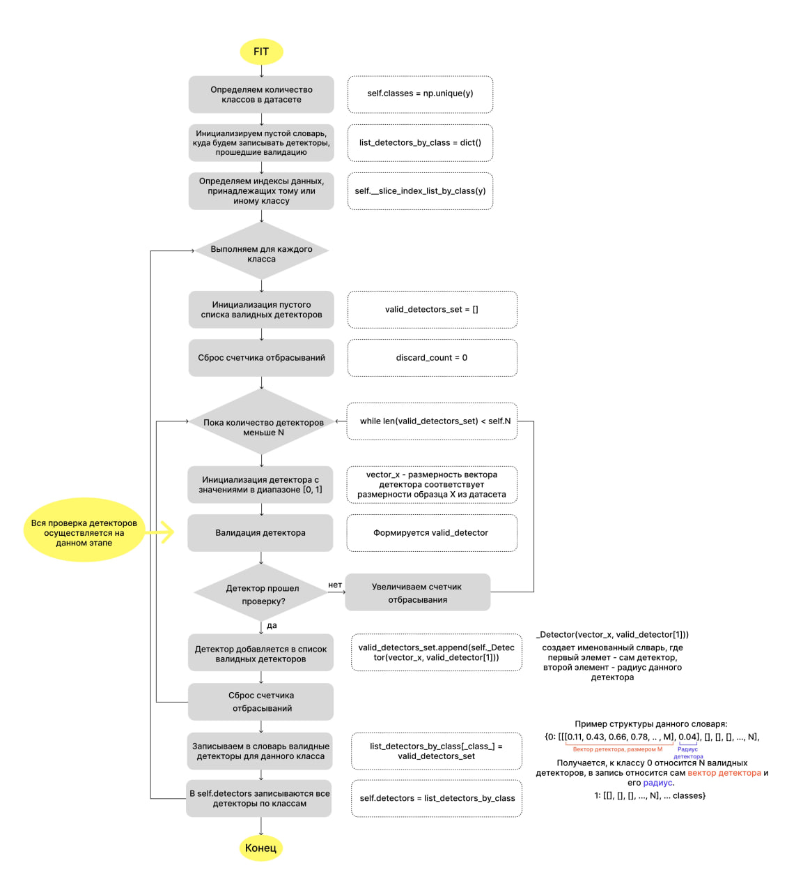
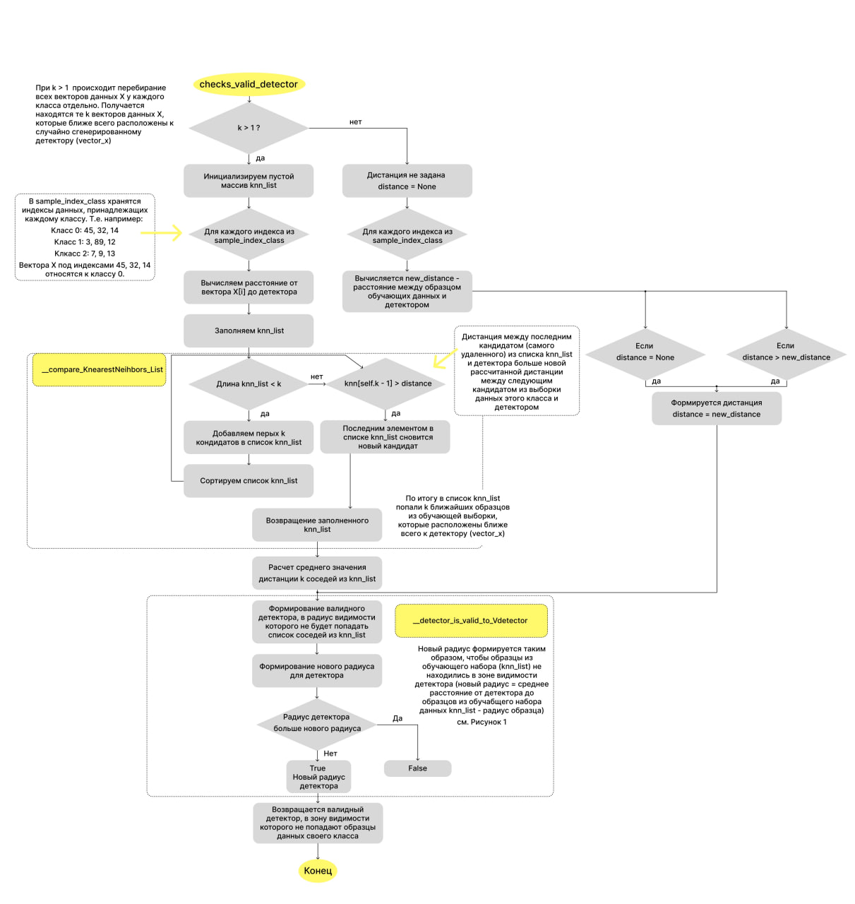

Искусственная иммунная система (ИИС) моделирует способность естественной иммунной системы обнаруживать чужеродные для организма клетки. Главным функционирующим элементом в иммунной системе являются лимфоциты. Лимфоциты бывают двух видов: В-клетки и Т-клетки. И те и другие обладают специфическими рецепторами, которые соответсвуют одному типу антигена. Антиген - это и есть патологическая клетка (если быть точнее, это белок на поверхности патологической клетки). 

**Существует три модели ИИС:** 
- клональный отбор;
- отрицательный отбор; 
- сетевая ИИС. 

1 и 3 основаны на принципе действия В-клеток лимфоцитов. 2-ая модель рассматривает принцип созревания Т-лимфоцитов в тимусе. Т-клетки помогают В-клеткам вырабатывать антитела для подавления патологических клеток.  

На поверхности собственных клеток также как и на поверхности антигенов (патологических клеток) имеются рецепторы, чтобы лимфоциты не атаковали собственные клетки организма, они должны обладать "памятью". Формирование данной "памяти" происходит как раз при созревании Т-клеток лимфоцитов. Внутри вилочковой железы происходит отрицательная селекция клеток Т-лимфоцитов. Эту селекцию проходят только те особи, которые не способны атаковать собственные клетки организма, таким образом уничтожаются все клетки Т-лимфоцитов, которые могут реагировать с собственными клетками организма - в этом и заключается алгоритм отрицательного отбора. 

В данной работе роль Т-лимфоцитов представляют детекторы, которые имеют размерность, в соотвествии с вектором из обучающего набора данных. Для каждого класса генерируется N-детекторов, которые проходят свой отрицательный отбор в функции fit. Затем в результате обучения возвращаются детекторы (Т-лимфоциты), которые не реагируют на собственный класс (на собственные клетки организма). Классификация тестового набора данных происходит в функции predict. Здесь, если вектор данных попадает в радиус видимости детектора, то детектор классифицирует данный вектор как "патологическую клетку" - образец не его класса. 

**fit**
1. Инициализация случайных детекторов в [0, 1]
2. Перебор всех векторов из обучающего набора данных (соответствующих классу детектора), определяем самых ближайших соседей (=k) у сгенерированного детектора;
3. Детектор проходит проверку по радиусу. В его радиус видимости (r) не должны попадаться обучающие данные его класса (= Т-клетка не должна реагировать на собственные клетки организма), если детектор прошел проверку, то он добавляется в список Т-клеток для созревания, если нет, то для детектора вычисляется новый радиус, благодаря которому детектор пройдет проверку.

**Этап создания валидного детектора**

**Блок схема метода fit**

**Вспомогательный блок для метода fit**

**predict**

По каждому вектору из тестового набора проходимся всеми детекторами (детекторами всех классов), каждый детектор делает свои выводы о принадлежности данного образца к тому или иному классу. По итогу образцу присвается тот класс, в котором расстояние от образца до всех детекторов данного класса является наибольшим (т.е. образец Х находится дальше всего от группы детектором данного класса, следовательно, он принадлежит к данному классу, ведь детекторы изначально генерировались так, чтобы в их радиус видимости не попадали образцы собственного класса).

**Блок схема predict**

**Вспомогательный блок для predict**

